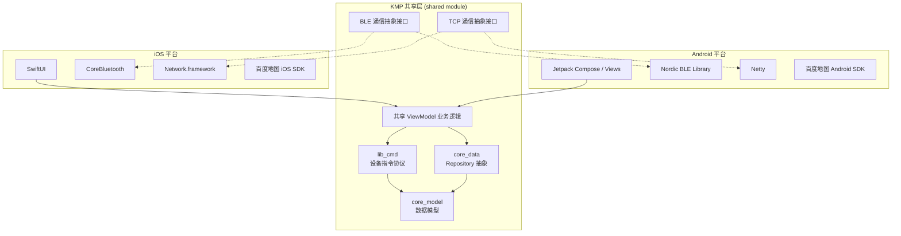
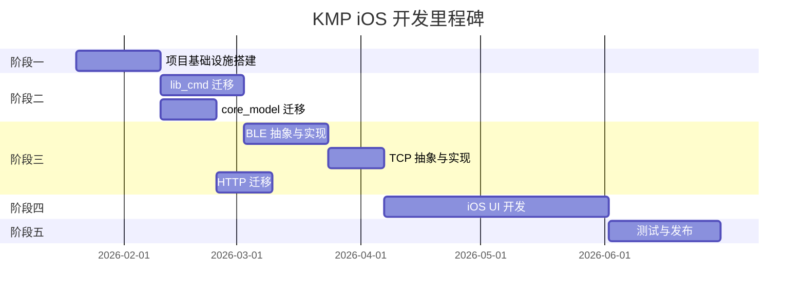

# 米易通 iOS 版本 - Kotlin Multiplatform 开发实施计划

> **文档版本**: v1.0  
> **创建日期**: 2026-01-12  
> **状态**: 待审核

## 1. 项目概述

### 1.1 目标

基于现有 Android 项目 `mCloudapp_V5`，采用 **Kotlin Multiplatform (KMP)** 技术方案开发 iOS 版本，实现核心业务逻辑代码跨平台共享，最大化代码复用率。

### 1.2 现有项目分析

| 模块 | 文件数量 | 核心功能 | KMP 兼容性评估 |
|------|----------|----------|----------------|
| `lib_cmd` | 116+ 解析器 + 139+ 数据模型 | 设备指令协议解析 | ⭐⭐⭐⭐⭐ **可直接复用** |
| `core_model` | 34 文件 | 数据模型定义 | ⭐⭐⭐⭐⭐ **可直接复用** |
| `core_data` | 27 文件 | 数据仓库层 | ⭐⭐⭐ 需替换 RxHttp → Ktor |
| `lib_ble` | 32 文件 | BLE 蓝牙通信 | ⭐⭐ 需 `expect/actual` 抽象 |
| `lib_tcp` | 11 文件 | TCP 长连接 | ⭐⭐ 需 `expect/actual` 抽象 |
| `lib_network` | 23 文件 | HTTP 网络请求 | ⭐⭐⭐ 需替换为 Ktor |
| `app` | 1205+ 文件 | UI 层实现 | ⭐ iOS 需用 SwiftUI 重写 |

### 1.3 代码复用预估

```
┌─────────────────────────────────────────────────────────────────┐
│                     代码复用率预估                               │
├─────────────────────────────────────────────────────────────────┤
│  ████████████████████████████████░░░░░░░░░░  ~65% 共享代码      │
│  └─ lib_cmd (协议层) + core_model + 业务逻辑                     │
├─────────────────────────────────────────────────────────────────┤
│  ██████████████░░░░░░░░░░░░░░░░░░░░░░░░░░░░  ~35% 平台特定代码  │
│  └─ lib_ble + lib_tcp + UI 层                                    │
└─────────────────────────────────────────────────────────────────┘
```

---

## 2. 技术架构设计

### 2.1 整体架构



### 2.2 KMP 技术栈选型

| 层级 | 技术选型 | 说明 |
|------|---------|------|
| **UI (iOS)** | SwiftUI | Apple 官方声明式 UI 框架 |
| **UI (Android)** | 保持现有架构 | Jetpack Compose 可选升级 |
| **网络请求** | [Ktor Client](https://ktor.io/docs/client.html) | 跨平台 HTTP 客户端，替代 RxHttp |
| **序列化** | [kotlinx.serialization](https://github.com/Kotlin/kotlinx.serialization) | 跨平台 JSON 序列化，替代 Moshi |
| **本地存储** | [SQLDelight](https://cashapp.github.io/sqldelight/) | 跨平台数据库，替代 Room |
| **键值存储** | [multiplatform-settings](https://github.com/russhwolf/multiplatform-settings) | 跨平台 KV 存储，替代 MMKV |
| **依赖注入** | [Koin](https://insert-koin.io/) | 已支持 KMP |
| **异步处理** | Kotlin Coroutines + Flow | 原生支持 |
| **日志** | [Napier](https://github.com/AAkira/Napier) | 跨平台日志，替代 Timber |

---

## 3. 分阶段实施计划

### 阶段一：项目基础设施搭建 (2-3 周)

#### 3.1.1 创建 KMP 项目结构

```
mCloudApp_KMP/
├── shared/                          # KMP 共享模块
│   ├── src/
│   │   ├── commonMain/              # 共享代码
│   │   │   ├── kotlin/
│   │   │   │   ├── command/         # lib_cmd 迁移
│   │   │   │   ├── model/           # core_model 迁移
│   │   │   │   ├── data/            # core_data 抽象
│   │   │   │   ├── platform/        # 平台抽象接口
│   │   │   │   └── viewmodel/       # 共享业务逻辑
│   │   │   └── resources/
│   │   ├── androidMain/             # Android 平台实现
│   │   │   └── kotlin/
│   │   │       └── platform/        # BLE/TCP Android 实现
│   │   ├── iosMain/                 # iOS 平台实现
│   │   │   └── kotlin/
│   │   │       └── platform/        # BLE/TCP iOS 实现
│   │   └── commonTest/              # 共享单元测试
│   └── build.gradle.kts
├── androidApp/                      # Android 应用（集成现有代码）
├── iosApp/                          # iOS 应用（SwiftUI）
└── build.gradle.kts
```

#### 3.1.2 Gradle 配置

```kotlin
// shared/build.gradle.kts
plugins {
    kotlin("multiplatform")
    kotlin("plugin.serialization")
    id("com.android.library")
    id("app.cash.sqldelight")
}

kotlin {
    androidTarget()
    
    listOf(
        iosX64(),
        iosArm64(),
        iosSimulatorArm64()
    ).forEach {
        it.binaries.framework {
            baseName = "shared"
            isStatic = true
        }
    }
    
    sourceSets {
        commonMain.dependencies {
            implementation("org.jetbrains.kotlinx:kotlinx-coroutines-core:1.8.0")
            implementation("org.jetbrains.kotlinx:kotlinx-serialization-json:1.6.3")
            implementation("io.ktor:ktor-client-core:2.3.12")
            implementation("io.ktor:ktor-client-content-negotiation:2.3.12")
            implementation("io.ktor:ktor-serialization-kotlinx-json:2.3.12")
            implementation("io.insert-koin:koin-core:3.5.6")
            implementation("com.russhwolf:multiplatform-settings:1.1.1")
            implementation("io.github.aakira:napier:2.7.1")
        }
        
        androidMain.dependencies {
            implementation("io.ktor:ktor-client-okhttp:2.3.12")
            implementation("io.insert-koin:koin-android:3.5.6")
        }
        
        iosMain.dependencies {
            implementation("io.ktor:ktor-client-darwin:2.3.12")
        }
    }
}
```

#### 3.1.3 任务清单

- [ ] 初始化 KMP 项目结构
- [ ] 配置 Gradle 多平台构建
- [ ] 配置 iOS Framework 导出
- [ ] 集成 SQLDelight、Ktor、kotlinx.serialization
- [ ] 创建 CI/CD 基础配置

---

### 阶段二：核心共享模块迁移 (4-6 周)

#### 3.2.1 lib_cmd 模块迁移（设备指令协议）

> **复用率: ~95%** — 该模块为纯 Kotlin 业务逻辑，无平台依赖

**迁移内容：**

| 子模块 | 文件数 | 迁移策略 |
|--------|--------|----------|
| `iot_cmd/model/` | 139 | 直接迁移，Moshi 注解替换为 kotlinx.serialization |
| `iot_cmd/parser/` | 116 | 直接迁移，纯 Kotlin 逻辑 |
| `iot_cmd/enums/` | 多个 | 移除 `@Parcelize`，使用 `@Serializable` |
| `iot_cmd/interfaces/` | 1 | 直接迁移 |
| `iot_cmd/utils/` | 多个 | 直接迁移 |

**代码修改示例：**

```diff
// 修改前 (Android)
- import android.os.Parcelable
- import kotlinx.parcelize.Parcelize
- import com.squareup.moshi.JsonClass

- @Parcelize
- @JsonClass(generateAdapter = true)
  enum class ProductType(...) : Parcelable {

// 修改后 (KMP)
+ import kotlinx.serialization.Serializable

+ @Serializable
  enum class ProductType(...) {
```

**任务清单：**

- [ ] 迁移 `IOTCommandParser` 接口
- [ ] 迁移 `IOTParserManager` 和 `IOTParserRegistry`
- [ ] 迁移所有设备解析器（116个）
  - [ ] ADME 系列解析器
  - [ ] DAS 系列解析器
  - [ ] GNSS_M 系列解析器
  - [ ] GT600 系列解析器
  - [ ] Common 通用解析器
- [ ] 迁移所有数据模型（139个，移除 Moshi/Parcelize 依赖）
- [ ] 迁移 `ProductType` 枚举（40+ 设备类型）
- [ ] 编写单元测试验证解析逻辑正确性

#### 3.2.2 core_model 模块迁移

> **复用率: ~90%**

**迁移内容：**

- 移除 Moshi `@JsonClass` 和 `@Json` 注解
- 替换为 kotlinx.serialization 的 `@Serializable` 和 `@SerialName`

```diff
// 修改前
- import com.squareup.moshi.Json
- import com.squareup.moshi.JsonClass

- @JsonClass(generateAdapter = true)
  data class DeviceDetailInfo(
-     @Json(name = "deviceBaseInfo")
      val deviceInfo: DeviceInfo
  )

// 修改后
+ import kotlinx.serialization.Serializable
+ import kotlinx.serialization.SerialName

+ @Serializable
  data class DeviceDetailInfo(
+     @SerialName("deviceBaseInfo")
      val deviceInfo: DeviceInfo
  )
```

**任务清单：**

- [ ] 迁移所有 34 个数据模型类
- [ ] 验证序列化/反序列化兼容性

---

### 阶段三：通信层抽象与实现 (4-5 周)

#### 3.3.1 BLE 蓝牙通信抽象

**接口设计：**

```kotlin
// commonMain: 平台抽象接口
expect class BlePlatformManager {
    suspend fun scan(filter: BleDeviceFilter): Flow<BleDevice>
    suspend fun connect(device: BleDevice): BleConnection
}

interface BleConnection {
    val connectionState: StateFlow<ConnectionState>
    suspend fun sendCommand(command: String): String
    suspend fun disconnect()
}

// androidMain: Android 实现（复用现有 Nordic BLE）
actual class BlePlatformManager {
    private val manager: MedoBleManager = ...
    // 使用现有 lib_ble 实现
}

// iosMain: iOS 实现
actual class BlePlatformManager {
    // 使用 CoreBluetooth
    private val centralManager = CBCentralManager()
    // ...
}
```

**任务清单：**

- [ ] 设计 BLE 通信抽象接口（`BleManager`, `BleConnection`, `BleDevice`）
- [ ] Android 端：适配现有 `MedoBleManager` 实现
- [ ] iOS 端：基于 `CoreBluetooth` 实现
  - [ ] 设备扫描
  - [ ] 连接管理
  - [ ] 数据收发
  - [ ] 断开重连
- [ ] 编写集成测试

#### 3.3.2 TCP 通信抽象

**接口设计：**

```kotlin
// commonMain
expect class TcpPlatformClient {
    suspend fun connect(host: String, port: Int): TcpConnection
}

interface TcpConnection {
    val connectionState: StateFlow<TcpConnectionState>
    suspend fun send(data: String)
    fun receive(): Flow<String>
    suspend fun disconnect()
}

// androidMain: 复用现有 Netty 实现
// iosMain: 使用 Network.framework (NWConnection)
```

**任务清单：**

- [ ] 设计 TCP 通信抽象接口
- [ ] Android 端：适配现有 `NettyTcpClient`
- [ ] iOS 端：基于 `Network.framework` 实现
  - [ ] 连接建立
  - [ ] 心跳保活
  - [ ] 数据收发
  - [ ] 重连机制
- [ ] 编写集成测试

#### 3.3.3 HTTP 网络请求迁移

**迁移策略：** RxHttp → Ktor Client

```kotlin
// 共享层 Repository
class NetDataRepository(private val httpClient: HttpClient) {
    
    suspend fun loginByAccount(jsonParam: String): Result<String> {
        return runCatching {
            httpClient.post("/SignIn") {
                setBody(jsonParam)
                header("access_type", "android")
            }.body()
        }
    }
}
```

**任务清单：**

- [ ] 配置 Ktor Client（含拦截器、序列化）
- [ ] 迁移 `NetDataRepository` 所有 API 方法
- [ ] 实现统一错误处理
- [ ] 验证与后端 API 兼容性

---

### 阶段四：iOS UI 开发 (6-8 周)

#### 3.4.1 iOS App 架构

```
iosApp/
├── MCloudApp/
│   ├── App/
│   │   └── MCloudApp.swift          # App 入口
│   ├── Features/
│   │   ├── Login/                    # 登录模块
│   │   ├── DeviceList/               # 设备列表
│   │   ├── DeviceDetail/             # 设备详情
│   │   │   ├── GNSS/                 # GNSS 设备页面
│   │   │   ├── ADME/                 # ADME 设备页面
│   │   │   └── DAS/                  # DAS 设备页面
│   │   └── Settings/                 # 设置
│   ├── Core/
│   │   ├── DI/                       # Koin 桥接
│   │   ├── Extension/                # Swift 扩展
│   │   └── Theme/                    # 主题样式
│   └── Resources/
└── Podfile                           # CocoaPods 依赖
```

#### 3.4.2 SwiftUI 与 KMP 集成示例

```swift
import SwiftUI
import shared  // KMP Framework

struct DeviceListView: View {
    @StateObject private var viewModel = DeviceListViewModel()
    
    var body: some View {
        List(viewModel.devices, id: \.id) { device in
            DeviceRowView(device: device)
        }
        .onAppear {
            viewModel.loadDevices()
        }
    }
}

class DeviceListViewModel: ObservableObject {
    private let repository: DeviceRepository
    @Published var devices: [DeviceInfo] = []
    
    init() {
        // 从 Koin 获取共享层 Repository
        self.repository = KoinHelper.shared.deviceRepository
    }
    
    func loadDevices() {
        Task {
            let result = try await repository.getDeviceList()
            await MainActor.run {
                self.devices = result
            }
        }
    }
}
```

#### 3.4.3 UI 开发任务清单

- [ ] 登录页面
- [ ] 设备扫描与配对页面
- [ ] 设备列表页面
- [ ] 设备详情页面（按设备类型分别实现）
  - [ ] GNSS 接收机系列（M20/M50/E40/GT600）
  - [ ] ADME 自动测斜仪
  - [ ] DAS 采集器
  - [ ] 其他传感器
- [ ] 地图定位页面（集成百度地图 iOS SDK）
- [ ] 设置页面

---

### 阶段五：测试与发布 (3-4 周)

#### 3.5.1 测试策略

| 测试类型 | 工具 | 覆盖范围 |
|----------|------|----------|
| 单元测试 | kotlin.test | 共享层业务逻辑 |
| 集成测试 | - | BLE/TCP 通信 |
| UI 测试 (iOS) | XCTest | SwiftUI 页面 |
| 端到端测试 | - | 与真实设备通信 |

#### 3.5.2 发布准备

- [ ] App Store 开发者账号配置
- [ ] 配置 iOS 签名证书与 Provisioning Profile
- [ ] App Store Connect 应用配置
- [ ] 编写隐私政策（BLE、位置权限说明）
- [ ] 准备 App Store 截图与描述
- [ ] TestFlight 内测发布
- [ ] 正式发布

---

## 4. 验证计划

### 4.1 自动化测试

#### 4.1.1 单元测试（共享层）

```bash
# 运行所有共享层单元测试
./gradlew :shared:testDebugUnitTest

# 运行 iOS 模拟器测试
./gradlew :shared:iosSimulatorArm64Test
```

**测试覆盖重点：**

- `lib_cmd` 指令解析器：验证所有设备类型的指令解析正确性
- `core_model` 数据模型：验证序列化/反序列化与后端 API 兼容
- Repository 层：Mock 测试业务逻辑

#### 4.1.2 iOS UI 测试

```bash
# 使用 xcodebuild 运行 UI 测试
xcodebuild test -workspace iosApp.xcworkspace -scheme MCloudApp -destination 'platform=iOS Simulator,name=iPhone 15'
```

### 4.2 手动测试

#### 4.2.1 BLE 通信测试

1. 准备一台已知的 GNSS 设备（如 M20）
2. 在 iOS App 中进入设备扫描页面
3. 验证能发现设备并显示正确的设备名称
4. 点击连接，验证连接成功
5. 发送读取设备信息指令，验证返回数据正确解析

#### 4.2.2 功能对比测试

对照 Android 版本，逐页面验证 iOS 版本功能一致性：

- [ ] 登录流程
- [ ] 设备列表加载
- [ ] 设备连接与断开
- [ ] 指令发送与响应
- [ ] 设备参数配置
- [ ] 地图定位功能

---

## 5. 风险与应对

| 风险 | 可能性 | 影响 | 应对措施 |
|------|--------|------|----------|
| BLE 协议在 iOS 上行为差异 | 中 | 高 | 提前进行原型验证，准备多种设备测试 |
| 百度地图 iOS SDK 集成问题 | 低 | 中 | 备选方案：使用 Apple MapKit |
| KMP 编译性能问题 | 低 | 低 | 使用 Gradle 增量编译，配置构建缓存 |
| 跨平台序列化兼容性 | 中 | 中 | 编写完善的单元测试，持续集成验证 |

---

## 6. 里程碑时间线



**预计总工期：20-24 周（5-6 个月）**

---

## 7. 附录

### 7.1 参考资源

- [Kotlin Multiplatform 官方文档](https://kotlinlang.org/docs/multiplatform.html)
- [KMP 示例项目 - KaMPKit](https://github.com/touchlab/KaMPKit)
- [Ktor Client 文档](https://ktor.io/docs/getting-started-ktor-client.html)
- [SQLDelight 文档](https://cashapp.github.io/sqldelight/)
- [Apple CoreBluetooth 文档](https://developer.apple.com/documentation/corebluetooth)

### 7.2 现有项目关键文件参考

| 文件 | 用途 |
|------|------|
| [IOTCommandParser.kt](file:///Users/gonghe/Work/CompanyProject/mCloudapp_V5/lib_cmd/src/main/java/com/shmedo/lib/cmd/base/iot_cmd/interfaces/IOTCommandParser.kt) | 指令解析器接口定义 |
| [ProductType.kt](file:///Users/gonghe/Work/CompanyProject/mCloudapp_V5/lib_cmd/src/main/java/com/shmedo/lib/cmd/base/iot_cmd/enums/ProductType.kt) | 设备类型枚举（40+ 类型） |
| [MedoBleManager.kt](file:///Users/gonghe/Work/CompanyProject/mCloudapp_V5/lib_ble/src/main/java/com/shmedo/lib/ble/communicate/data/MedoBleManager.kt) | BLE 管理器实现 |
| [NettyTcpClient.kt](file:///Users/gonghe/Work/CompanyProject/mCloudapp_V5/lib_tcp/src/main/java/com/shmedo/lib/tcp/netty/client/NettyTcpClient.kt) | TCP 客户端实现 |
| [NetDataRepository.kt](file:///Users/gonghe/Work/CompanyProject/mCloudapp_V5/core_data/src/main/java/com/shmedo/core/data/repository/NetDataRepository.kt) | 网络数据仓库 |
